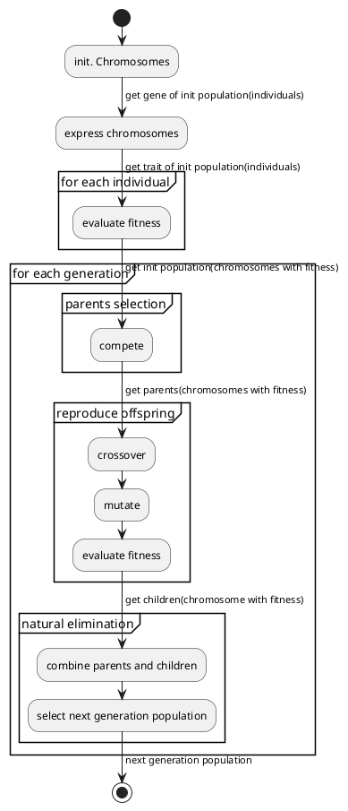

# Arichecture of openGA

<p align="right">by Neal Nie</p>

## Class

- Chromosome

    ```puml
    @startuml
    Class Chromosome {
        float[] genes
        str[] names
        (Chromosome, Chromosome) crossover(Chromosome couple, float eta)
        Chromosome mutate(float eta)
    }
    @enduml
    ```

- Individual

    ```puml
    @startuml
    Class Individual {
        int gen_id
        int idv_id
        float fittness
        Chromosome plasm
        ==**patch**==
        --public--
        evaluate()
        --private--
        express()
    }
    @enduml
    ```

- Population

    ```puml
    @startuml
    Class Population {
        int gen_id
        int size
        Individual[] curr_gen
        Individual[] parents
        Individual[] children
        Individual[] next_gen
        --public--
        select() -> parents
        reproduce() -> children
        elmiate() -> next generation
        --private--
        evaluate() -> update fittness
        compete() -> return winner idv_id
        combine() -> 
    }
    @enduml
    ```

## Framework


