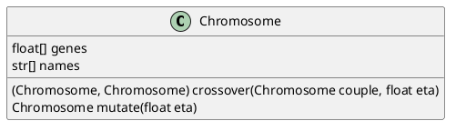

# Arichecture of openGA

by Nie Guangze

## Framework

`ToDo`

## Class

```puml
@startuml
Class Chromosome {
    float[] genes
    str[] names
    (Chromosome, Chromosome) crossover(Chromosome couple, float eta)
    Chromosome mutate(float eta)
}
@enduml
```
